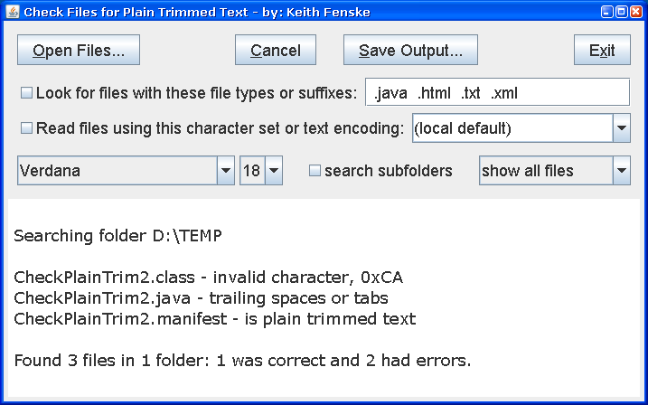

### Check Plain Trim (Java)

by: Keith Fenske, https://kwfenske.github.io/

CheckPlainTrim is a Java 1.4 application to check if files are in plain text
and do not have trailing spaces or tabs (white space) at the end of lines. How
clean are your source, text files, and XML documents?

Download the ZIP file here: https://kwfenske.github.io/check-plain-trim-java.zip

Released under the terms and conditions of the Apache License (version 2.0 or
later) and/or the GNU General Public License (GPL, version 2 or later).

